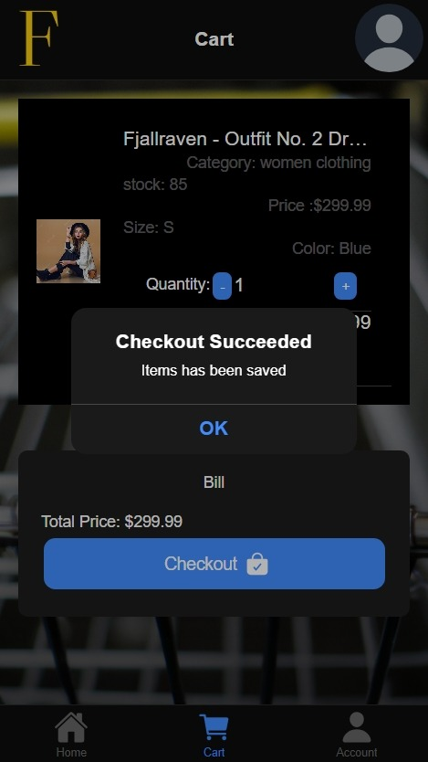

<!-- 

For more details and a project demonstration, please refer to the <a href="https://drive.google.com/drive/folders/1jno7oegXiC-j2LzEKlWBgRNlfFcnk-y2?usp=share_link" target="_blank">Rapport + Demo</a> (French) in the Google Drive folder (currently only ump accounts allowed ) .
 -->

# FitFabrics

FitFabrics is a secure and user-friendly E-Commerce application, developed using Ionic 6 and Firebase. It offers a convenient platform for online clothes trading, ensuring a seamless and reliable experience for users.

## Screenshots
| Login | Register  | Home Page  |
|------------|------------|------------|
|   |   |   |

## Lessons Learned

 - Angular Framework: I gained a deep understanding of the Angular framework and its concepts, such as components, modules, services, and routing. I learned how to build scalable and maintainable web applications using Angular.

- Ionic Framework: I acquired knowledge of the Ionic framework, which enabled me to develop mobile applications using web technologies. I learned about Ionic components, navigation, theming, and how to create a seamless user experience across multiple platforms.

- Mobile Development: Through this project, I gained experience in mobile app development. I learned about the unique challenges and considerations when building applications for mobile devices, including optimizing performance, handling different screen sizes, and integrating with native device features.

- Firebase: I explored the Firebase platform and its various services. I learned how to leverage Firebase Authentication for user authentication and Firebase Firestore for real-time data storage and retrieval. Additionally, I gained insights into integrating Firebase features like Cloud Messaging and Cloud Functions into my application.
## Features

- Product Catalog: A comprehensive catalog with intuitive navigation, powerful search functionality, and advanced filtering options for seamless product discovery.

- User Registration and Authentication: Secure user registration, login , deletion , changing password , and social media authentication for personalized experiences and data privacy.

- Shopping Cart: Effortlessly add, modify, and remove products in a persistent shopping cart, providing a convenient and streamlined shopping experience.

- Fullscreen mode: Enable a fullscreen mode for an immersive browsing experience.
- Cross platform: Hybrid application that ensure compatibility and seamless functionality across multiple platforms and devices.

## 🛠 Technologies & Tools

**Client:** Ionic, Angular

**Database:** Firebase

**Fake Store API Integration:**

This project integrates the Fake Store API as a mock data source for the e-commerce application. The Fake Store API provides a simulated environment with product data, allowing the application to fetch and display products without relying on a real e-commerce backend.

To interact with the Fake Store API, the application utilizes HTTP requests to retrieve product information, such as title, price, description, and images. The API endpoints are accessed using the appropriate HTTP methods (GET, POST, PUT, DELETE) to perform operations like fetching products, adding items to the cart, and placing orders.

By integrating the Fake Store API, this application can demonstrate the core functionalities of an e-commerce platform while keeping the development process independent of a live production environment.

Please note that since the Fake Store API is a mock data source, any changes made within the application, such as adding items to the cart or placing orders, will not have real-world implications.

For more information on the Fake Store API, including the available endpoints and data structure, refer to the [Fake Store API documentation](https://fakestoreapi.com/docs).

## Supervised by 

- Sara Roubi
## Contributing

Contributions are always welcome to FitFabrics Project !

Feel free to explore the code and contribute to further enhancements of FitFabrics .If you have an idea for a new feature or have found a bug, feel free to open an issue. If you'd like to contribute code, please fork the repository and submit a pull request.

## Other Screenshots
- products list 

---

- Choose an item and add it to cart
 

| Select item  | Item selection successful |
|------------|------------|
|  |  |

---
- Careful ! Some items may be sold out 

---
| Check the chosen items in cart  | Validate choice  |
|------------|------------|
|  |  |
---

<!-- - Check the chosen items in cart

---
- Validate choice

--- -->

- Account settings

---
- User CRUD 

| User Settings  | User Editing Info | Change Password  | Delete User |
|----------------|------------------|------------------|------------|
|   |   |  |  |

